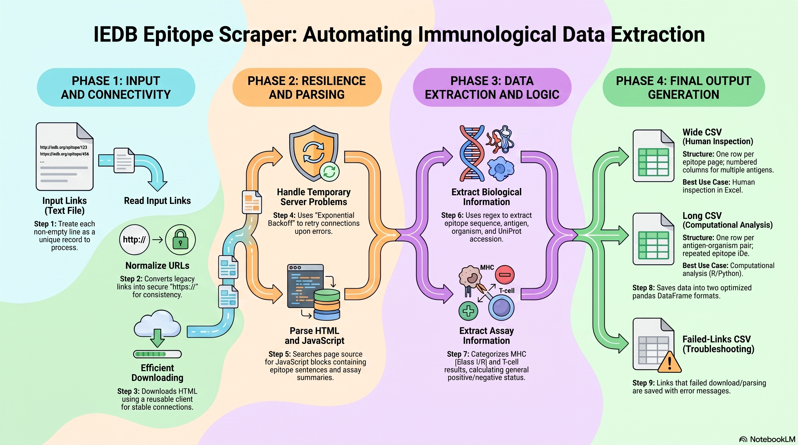
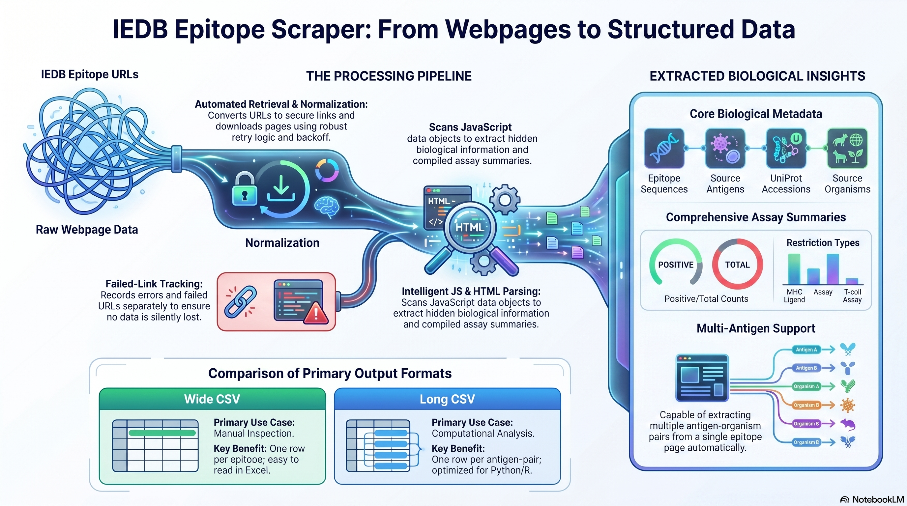

# IEDB Epitope Scraper

A Python command-line tool for extracting structured immunological data from IEDB epitope webpages.

The scraper reads a list of IEDB epitope URLs, downloads each page, parses hidden JavaScript/HTML data, and exports clean CSV tables containing epitope, antigen, UniProt, organism, MHC ligand, and T-cell assay information.



## What this tool does

This tool automates the conversion of IEDB epitope webpages into analysis-ready tabular data.

For each epitope URL, it extracts:

- Epitope sequence
- Source antigen/protein name
- UniProt accession, when available
- Source organism
- Positive and negative MHC ligand alleles
- T-cell assay summaries
- General T-cell response status
- Source URL

It also supports epitopes associated with multiple antigen-organism pairs, for example epitopes shared by related viral proteins or organisms.

## Workflow



The pipeline follows these main steps:

1. Read a text file with one IEDB epitope URL per line.
2. Normalize URLs from `http://` to `https://`.
3. Download each epitope webpage using `httpx`.
4. Retry temporary download failures using exponential backoff.
5. Parse HTML and JavaScript data blocks.
6. Extract biological metadata and assay summaries.
7. Save results as wide and long CSV files.
8. Save failed links and error messages when download or parsing problems occur.

## Input

A plain text file containing one IEDB epitope URL per line:

```text
https://www.iedb.org/epitope/234
https://www.iedb.org/epitope/32240
https://www.iedb.org/epitope/1593850
```

## Outputs

### 1. Wide CSV

One row per epitope page.

Useful for:

- Manual inspection
- Excel review
- Quick checking of extracted data

Example columns:

```text
Epitope
Antigen_1, UniProt_1, Organism_1
Antigen_2, UniProt_2, Organism_2
Positive MHC alleles
Negative MHC alleles
Total response T cell assay(s)
T-cell assay type columns
Source
```

### 2. Long CSV

One row per antigen-organism pair.

Useful for:

- Pandas/R analysis
- Filtering by organism
- Counting antigens or UniProt accessions
- Downstream plotting and benchmarking

Example columns:

```text
Epitope
Pair_index
Antigen
UniProt
Organism
Positive MHC alleles
Negative MHC alleles
Total response T cell assay(s)
T-cell assay type columns
Source
```

### 3. Log file

Records progress, warnings, retries, and errors during execution.

### 4. Failed-links CSV

Created when one or more links fail.

Example columns:

```text
Source
Failure_type
Error
Reference_string
```

Failure types may include:

```text
download
parsing
parsing_unexpected
parsing_no_expected_script
```

## Example output tables

The real output files may contain many assay-specific columns. The examples below show only representative columns to keep the tables readable.

### Long-format output

The long-format CSV contains one row per epitope-antigen-organism pair. This format is recommended for downstream analysis in pandas or R.

| Epitope | Pair_index | Antigen | UniProt | Organism | Positive MHC alleles | Total response T cell assay(s) | IFNg release | qualitative binding | Source |
|---|---:|---|---|---|---|---:|---|---|---|
| AAAATCALV | 1 | Serine proteinase inhibitor 2 | P15059 | Orthopoxvirus vaccinia (Vaccinia virus) | HLA-A*02:01, HLA-A*02:02, HLA-A*02:03, HLA-A*02:06, HLA-A*68:02 | 0 | 0/2 | - | https://www.iedb.org/epitope/24 |
| AAAWYLWEV | 1 | Genome polyprotein | P17763 | Dengue virus | HLA-A*02:01, HLA-A*02:06, HLA-A*02:17 | 1 | 2/3 | - | https://www.iedb.org/epitope/150101 |
| AADLDDFSKQL | 1 | Nucleoprotein | P0DTC9 | SARS-CoV2 | - | 1 | - | 1/1 | https://www.iedb.org/epitope/1330713 |

### Wide-format output

The wide-format CSV contains one row per epitope page. If an epitope is associated with multiple antigen-organism pairs, the script creates numbered columns such as `Antigen_1`, `Antigen_2`, `Antigen_3`, etc.

| Epitope | Antigen_1 | UniProt_1 | Organism_1 | Antigen_2 | UniProt_2 | Organism_2 | Positive MHC alleles | Total response T cell assay(s) | Source |
|---|---|---|---|---|---|---|---|---|---|
| KVKFYKREL | 17 kDa A-type inclusion protein | Q80HV0 | Orthopoxvirus vaccinia (Vaccinia virus) | - | - | - | HLA-A*30:01 | - | https://www.iedb.org/epitope/84864 |
| KINMSSGMR | 25 kDa core protein OPG138 | Q80HV7 | Orthopoxvirus vaccinia (Vaccinia virus) | - | - | - | HLA class I | - | https://www.iedb.org/epitope/419814 |
| KLWAQCVQL | Replicase polyprotein 1ab | P0C6X7 | SARS-CoV1 | Replicase polyprotein 1ab | P0DTD1 | SARS-CoV2 | dynamic per IEDB page | dynamic per IEDB page | https://www.iedb.org/epitope/32240 |

Note: the wide table can include additional numbered columns such as `Antigen_3`, `UniProt_3`, `Organism_3`, `Antigen_4`, `UniProt_4`, and `Organism_4` when an epitope maps to more than two antigen-organism pairs.

## Installation

Create an environment and install the required packages:

```bash
pip install pandas httpx beautifulsoup4 alive-progress
```

## Usage

Basic run:

```bash
python iedb_scraper.py \
  -i links.txt \
  -o output.csv \
  -o2 output_long.csv \
  -l run.log
```

Run with polite waiting and retry settings:

```bash
python iedb_scraper.py \
  -i links.txt \
  -o output.csv \
  -o2 output_long.csv \
  -l run.log \
  -s 2 \
  -r 20 \
  -m 5
```

## Command-line options

| Option | Meaning |
|---|---|
| `-i`, `--input` | Input text file with one IEDB URL per line. |
| `-o`, `--output_csv` | Output path for the wide CSV table. |
| `-o2`, `--output_long_csv` | Optional output path for the long CSV table. |
| `-org`, `--organism` | Optional organism override for the wide and long tables. |
| `-l`, `--log` | Output path for the log file. |
| `-s`, `--sleep_seconds` | Seconds to wait between normal links. Use `0` for no normal waiting. |
| `-r`, `--retry_base_delay` | Base retry delay for temporary server or network errors. |
| `-m`, `--max_retries` | Maximum download attempts per link. |

## Error handling and retry logic

The scraper retries temporary download problems such as:

- `429 Too Many Requests`
- `500`, `502`, `503`, `504` server errors
- Timeouts
- Server disconnections
- Network/protocol errors

When retrying, it uses exponential backoff. For example, with `-r 20`, retry waits are approximately:

```text
20 seconds
40 seconds
80 seconds
```

If a server provides a `Retry-After` header, the scraper uses the server-provided waiting time first.

## Recommended repository structure

```text
iedb_scraper/
├── iedb_scraper.py
├── README.md
├── IEDB_Epitope_Scraper_Workflow.png
├── Epitope_Scraper_Process_Flow_Diagram.png
├── requirements.txt
└── examples/
    └── links.txt
```

Suggested `requirements.txt`:

```text
pandas
httpx
beautifulsoup4
alive-progress
```

## Notes

- This scraper is intended for reproducible research and dataset preparation.
- Use reasonable sleep and retry settings to avoid overloading web servers.
- Keep both wide and long outputs: wide is best for human review, while long is best for computational analysis.
- Always inspect the failed-links CSV and log file after large runs.

## Acknowledgments

This tool is designed to work with public epitope information from the Immune Epitope Database and Analysis Resource (IEDB).
